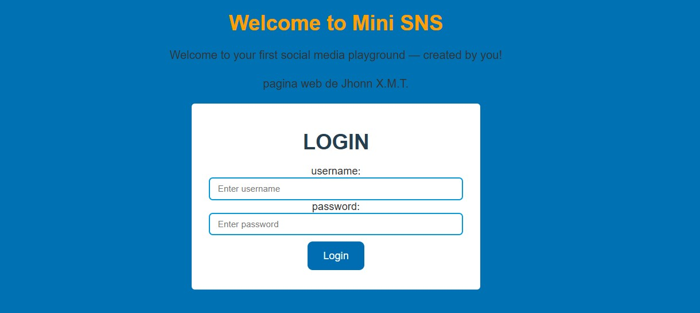

# 📌 Mini Proyectos JavaScript Mini Red Social
## login del mini proyecto

## menu del mini proyecto 

## Descripción

> Este proyecto es una aplicación web desarrollada con JavaScript, Nodejs y Express que permite a los usuarios observar una mini red social realizada mediante los cursos de la organizacion k-lab-Bolivia durante 2 semanas.

---

### Contenido adicional:

- ✅ Funcionalidades principales
    - Login de inicio de session.
    - Manejo de rutas.
    - Creacion de Post (guardadas en base de datos Mongo DB)
    - Mostrar el Post (obtenido de la base de datos Mongo DB)
- 🛠️ Tecnologías usadas
    - JavaScript.
    - Nodejs.
    - Express.
    - Motor de Plantillas EJS.
---
